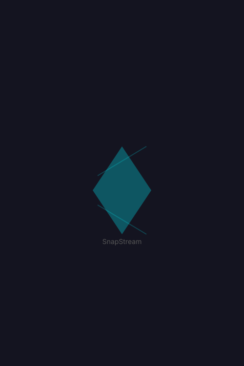

<div align="center">
  
  <h1>SnapStream V2</h1>
  <p><em>Infinite streaming for cinematic souls.</em></p>
  <p>
    <a href="https://github.com/Snapix/SnapstreamV2/releases"></a>
    <a href="https://github.com/Snapix/SnapstreamV2"></a>
    
  </p>
</div>

---

SnapStream V2 is a premium, beautifully designed movie and TV show streaming application. Built from the ground up with a cinematic, WebGL-powered glassmorphism UI, it aggregates multiple streaming sources into a single, ad-free, privacy-focused experience.

## 📱 Cross-Platform Availability

* 🌐 **Web:** Fully responsive SPA optimized for Vercel deployment.
* 🤖 **Android:** Native APK available now! Download the latest release from the [Releases tab](../../releases).
* 💻 **Windows & Linux (Coming Soon):** Native desktop applications featuring **hardware-accelerated 4K video playback** are currently in development.

## ✨ Features

* **Reliable Playback:** Uses 6+ dynamic embed sources (VidLink, VidSrc, SuperEmbed, 2Embed, SmashyStream, Embed.su) to ensure content is always available.
* **Cinematic UI/UX:**
    * Liquid glass design system with `backdrop-filter` and SVG chromatic displacement.
    * Real-time WebGL/OGL background animations (DarkVeil neural network shader).
    * Ken Burns hero carousels and smooth Framer Motion page transitions.
* **Comprehensive Metadata:** Powered by TMDB for accurate episode guides, cast details, ratings, and overviews.
* **TV Series Support:** Built-in season and episode picker that syncs directly with streaming providers.
* **Built-in AdBlock Guide:** Integrated instructions for setting up AdGuard DNS to block third-party player popups globally.
* **Privacy First:** No tracking, no user accounts, no telemetry.

## 🛠 Tech Stack

* **Framework:** React 18 + Vite + TypeScript
* **Styling:** Tailwind CSS v4 + custom `glass-system` design tokens + shadcn/ui
* **Animation & 3D:** Framer Motion, `ogl` (WebGL)
* **Routing:** React Router v6
* **Data API:** TMDB (The Movie Database)

## 🚀 Local Development

To run SnapStream V2 locally:

1.  **Clone the repository:**
    ```bash
    git clone https://github.com/Snapix/SnapstreamV2.git
    cd SnapstreamV2
    ```

2.  **Install dependencies:**
    ```bash
    npm install
    ```

3.  **Environment Variables:**
    Create a `.env` file in the root directory and add your TMDB API key:
    ```env
    VITE_TMDB_API_KEY=your_tmdb_api_key_here
    ```

4.  **Start the development server:**
    ```bash
    npm run dev
    ```

## 📦 Deployment

This project is configured for seamless deployment on Vercel. 
Push your code to the `main` branch, and Vercel will automatically build and deploy the SPA using the settings defined in `vercel.json` and `vite.config.ts`.

## ⚖️ Disclaimer

SnapStream V2 does not host any media files on its servers. The application functions solely as an aggregator and client-side interface, scraping and embedding video links from publicly available third-party platforms. SnapStream is not affiliated with TMDB or any of the streaming providers utilized.

---
<div align="center">
  <p>Built with 🩵 by <a href="https://github.com/Snapix">Snapix</a></p>
</div>
